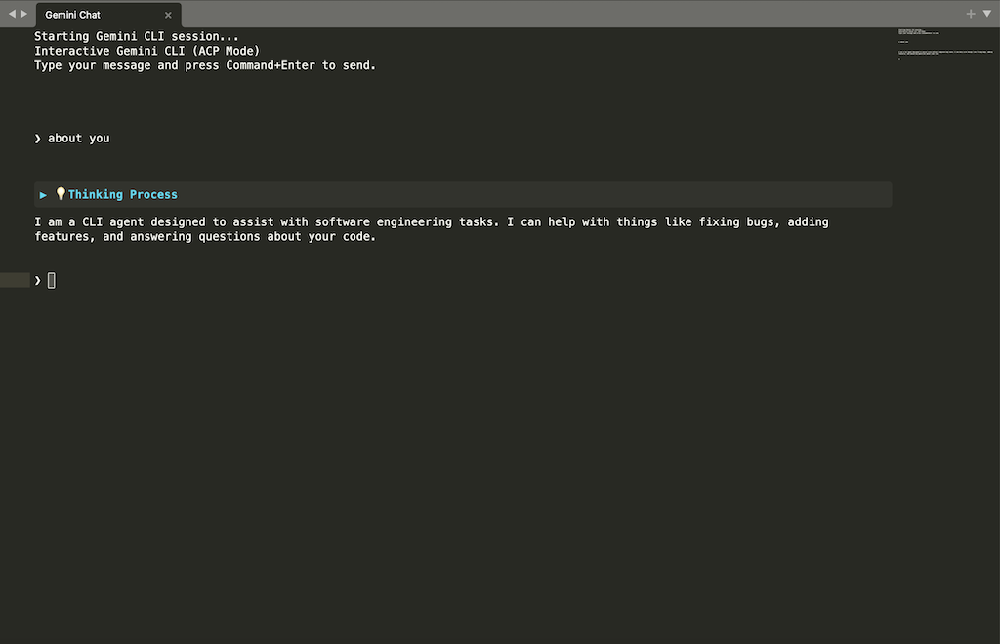

# Gemini CLI for Sublime Text

This package provides an interface to the Gemini CLI directly within Sublime Text.

**Note:** This plugin requires the `gemini` command-line tool to be installed and available in your system's `PATH`.
You can also set the gemini full path in the settings file with "gemini_command"

## Installation

1.  Open Sublime Text.
2.  Go to `Preferences` -> `Browse Packages...`.
3.  This will open the `Packages` directory.
4.  Copy the `GeminiCLI` directory into this `Packages` directory.
5.  Restart Sublime Text.

## Gemini Authentication

You need to authenticate before using the plugin. Supported methods:
- **Google Account OAuth**: Run `gemini` in your system terminal, then type `/auth` to login with your Google account.
- **API Key**: Obtain an API key from [Google AI Studio](https://aistudio.google.com/) and set it in `Preferences -> Package Settings -> GeminiCLI -> Settings`.

## Usage

1.  Open the command palette (`Cmd+Shift+P` on macOS, `Ctrl+Shift+P` on Windows/Linux).
2.  Type `Gemini: Start Chat` and press `Enter`.
3.  A new view will open for the Gemini chat.
4.  Alternatively, you can use the shortcut `Ctrl+Alt+G` (or `Super+Alt+G` on macOS).
5.  Type your message and press `Ctrl+Enter` (or `Super+Enter` on macOS) to send.

## Tips

### Chat with Gemini agent

You can right-click in any file, tab, or sidebar item and select **Chat with Gemini agent**. This will:
- Open the Gemini chat view (if not already open).
- Insert a reference to the file (`@filename`) or selected line range (`@filename#L1-10`) into the message prompt.
- Tagged files will be automatically sent as context to Gemini.

### Set Gemini Working Space

Right-click on any folder in the sidebar and select **Set Gemini Working Space** to set the working directory for Gemini. This affects the current working directory when Gemini executes commands or accesses files.

### prompt from command

Use the command palette (`Gemini: Prompt`) to send a quick instruction to Gemini without opening the chat view manually.

## License

This project is licensed under the MIT License - see the [LICENSE](LICENSE) file for details.