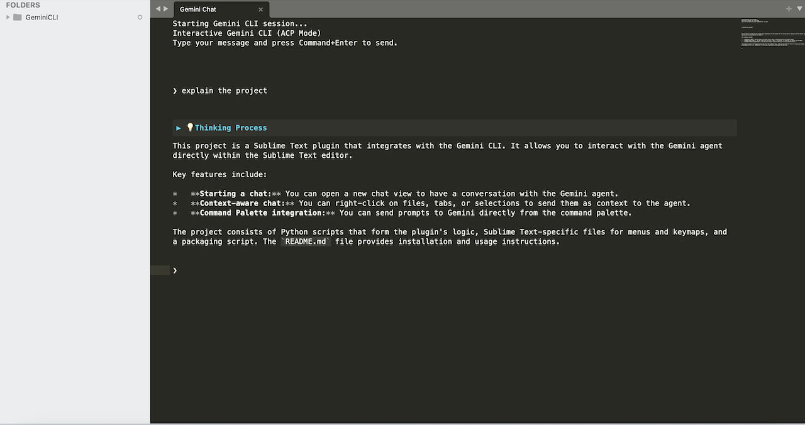

# Gemini CLI for Sublime Text

This package provides an agentic interface to the google Gemini CLI directly within Sublime Text.



## Prerequisites
This plugin relies on the Google Gemini CLI. Install the required CLI tool:

```bash
npm install -g @google/gemini-cli
```

For detailed installation, refer to the [geminicli official docs](https://geminicli.com/docs/get-started/installation/).

> **Note:** The plugin automatically detects CLI installation across multiple environments, including **Homebrew**, **npm-global**, **Yarn**, and common local binary directories. You typically don't need to manually configure environment variables or search paths.

## Install GeminiCLI plugin from Package Control

The easiest way to install this plugin is through [Package Control](https://packagecontrol.io/packages/GeminiCLI).
1.  Open the command palette (`Cmd+Shift+P` on macOS, `Ctrl+Shift+P` on Windows/Linux).
2.  Type `Package Control: Install Package` and press `Enter`.
3.  Search for `GeminiCLI` and press `Enter`.

The plugin automatically detects gemini-cli. If the command line tool is installed elsewhere, or you wish to use a specific `gemini`version, you can manually set the path in ` Preferences -> Package Settings -> GeminiCLI -> Settings`
For example set the `"gemini_command"` in settings with:
- Windows: `"C:/Users/myname/AppData/Roaming/npm/gemini.cmd"`
- macOS/Linux: `"/usr/local/bin/gemini"`

## Gemini Authentication

You need to authenticate before using the plugin. Supported methods:
- **gemini cli auth**: Run `gemini` in your system terminal, then type `/auth` to login with your Google account.
- **API Key**: Obtain an API key from [Google AI Studio](https://aistudio.google.com/) and set it in `Preferences -> Package Settings -> GeminiCLI -> Settings`.
- **Google Vertex AI**: If you're using Vertex AI on Google Cloud, configure your project and location in the `env` section of your settings:
    ```
    "env": {
        "GOOGLE_CLOUD_PROJECT": "your-project-id",
        "GOOGLE_CLOUD_LOCATION": "us-central1"
    }
    ```
    Ensure you've authenticated with your Google Cloud account via `gcloud auth application-default login`.

## Start Gemini Chat

1.  Open the command palette (`Cmd+Shift+P` on macOS, `Ctrl+Shift+P` on Windows/Linux).
2.  Type `Gemini: Start Chat` and press `Enter`.
3.  A new view will open for the Gemini chat.
4.  Alternatively, you can use a shortcut to start the chat (see [Key Bindings](#key-bindings) for configuration).
5.  Type your message and press `Ctrl+Enter` (or `Super+Enter` on macOS) to send.

## Using Gemini in Sublime Text

### Context Menu: Chat with Current File or Selection

You can right-click in any file, tab, and select **Chat with Gemini agent**. This will:
- Open the Gemini chat view (if not already open).
- Insert a reference to the file (`@filename`) or selected line range (`@filename#L1-10`) into the message prompt.
- Tagged files will be automatically sent as context to Gemini.

### Sidebar: Set Gemini Working Space

Right-click on any folder in the sidebar and select **Set Gemini Working Space** to set the working directory for Gemini. This affects the current working directory when Gemini executes commands or accesses files.

### Quick Prompt Without Chat View

Use the command palette (`Gemini: Prompt`) to send a quick instruction to Gemini without opening the chat view manually.

### Gemini Approval Mode

Gemini CLI performs various actions (tools) like reading files, searching the web, or executing commands. You can control how much manual approval is required for these actions via the command palette: `Gemini: Approval Mode`

  - Default: Prompts for your approval by default.
  - Allow Edit: Automatically approves "safe" read/edit operations; still prompts for "risky" commands.
  - Accept All: Automatically approves all tool calls, including shell command execution.

## Key Bindings

this package does not include a global shortcut by default. You can add key bingding manually:

1.  Go to `Preferences -> Key Bindings`.
2.  Add the following lines to your user keymap file:
3.  now you can use the shortcut `Ctrl+Alt+G` (or `Super+Alt+G` on macOS) to start Gemini Chat

```json
[
    {
        "keys": ["ctrl+alt+g"],
        "command": "gemini_cli",
        "args": {}
    },
    {
        "keys": ["super+alt+g"],
        "command": "gemini_cli",
        "args": {},
        "context":
        [
            { "key": "setting.is_widget", "operand": false }
        ]
    }
]
```

## Manual Installation from github

1. Open Sublime Text and navigate to `Preferences` -> `Browse Packages...`.
2. This will open the `Packages` directory. clone the repository from [github](https://github.com/flashmodel/gemini-st) into the directory:                                                   │
3. Rename the repository folder to `GeminiCLI` directory; and Restart Sublime Text.

## Gemini Context Interaction and Data Privacy

By default, this plugin **does not** send your entire workspace or file contents to Gemini. Data is only sent to the Google Gemini CLI in the following scenarios:

*   **Chat Messages**: Any text you type directly into the Gemini Chat view.
*   **Explicit Context (@-mentions)**: When you use the `@filename` syntax (either manually or via the "Gemini: Chat with this file" context menu), the content of the specified file or selected range is sent.
*   **Tool-driven Context**: If the Gemini agent requests to read a file or list a directory (and you have granted permission if required by the CLI), that information is sent back to the model as part of the interaction.

All communication happens via the `gemini` CLI tool installed on your system, which connects directly to Google's servers using your configured credentials (API key or OAuth).

## License

This project is licensed under the MIT License - see the [LICENSE](LICENSE) file for details.