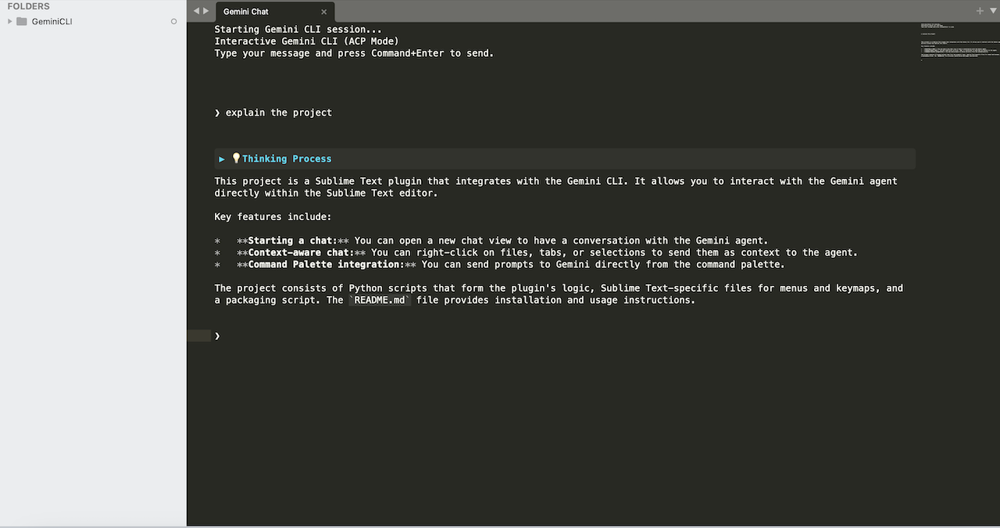

# Google Antigravity & Gemini for Sublime Text

[](https://packagecontrol.io/packages/GeminiCLI)

This package provides an agentic coding interface powered by gemini inside Sublime Text. It features **Google Antigravity** as the default agent alongside the legacy **Gemini CLI**.



> Looking to use **Claude Code or OpenAI Codex** in Sublime Text, install the [TermMate package](https://packagecontrol.io/packages/TermMate), a native multi-agent coding assistant with seamless agent switching, file context, plan mode, and session resume. [Explore TermMate’s features for Sublime Text](https://termmate.app/sublime/).

## Prerequisites

This plugin supports two google agent backends. You can install either one depending on your workflow:

```bash
# Antigravity CLI (macOS / Linux)
curl -fsSL https://antigravity.google/cli/install.sh | bash

# Antigravity CLI (Windows PowerShell)
irm https://antigravity.google/cli/install.ps1 | iex

# install geminicli via npm
npm install -g @google/gemini-cli
```

## Install GeminiCLI plugin from Package Control

The easiest way to install this plugin is through [Package Control](https://packagecontrol.io/packages/GeminiCLI).

1.  Open the command palette (`Cmd+Shift+P` on macOS, `Ctrl+Shift+P` on Windows/Linux).
2.  Type `Package Control: Install Package` and press `Enter`.
3.  Search for `GeminiCLI` and press `Enter`.

The plugin automatically detects antigravity and geminicli. If your CLI binaries are in non-standard locations, configure them under `Preferences -> Package Settings -> GeminiCLI -> Settings`:

```json
{
    "antigravity_command": "/usr/local/bin/agy",
    "gemini_command": "/usr/local/bin/gemini"
}
```

## Authentication

You can authenticate using either your **Google Account (OAuth)** or a **Gemini API Key**:

- **Google Account OAuth**: Run `agy` in your terminal:
  ```bash
  agy
  ```
  the CLI automatically launches your default web browser to complete Google account sign-in.
- **Gemini API Key**: If you prefer using an API key, set custom env in `Preferences -> Package Settings -> GeminiCLI -> Settings`:
  ```json
  "env": {
      "GEMINI_API_KEY": "your-api-key-here"
  }
  ```
- **Google Vertex AI (geminicli)**: If you're using Vertex AI on Google Cloud, configure your project and location in the `env` setting:
  ```json
  "env": {
      "GOOGLE_CLOUD_PROJECT": "your-project-id",
      "GOOGLE_CLOUD_LOCATION": "us-central1"
  }
  ```
  Ensure you have authenticated via `gcloud auth application-default login`.

## Start Gemini Chat

1. Open the command palette (`Cmd+Shift+P` on macOS, `Ctrl+Shift+P` on Windows/Linux).
2. Type `Gemini: Start Chat` and press `Enter`. Alternatively, you can use a shortcut to start the chat (see [Key Bindings](#key-bindings) for configuration).
3. Type your message and press `Ctrl+Enter` (or `Super+Enter` on macOS) to send.

To stop a running conversation, press `Shift+Escape` (or `Cmd+Escape` on macOS), or run `Gemini: Stop Conversation` from the command palette.

For detailed usage and features, see the [Gemini CLI for Sublime Text Guide](https://gemini.termmate.app).

## Using Gemini in Sublime Text

**Chat with Current File or Selection**

You can right-click in any file, tab, or item in the sidebar, and select **Chat with Gemini agent**. This will:

- Open the Gemini chat view (if not already open).
- Insert a reference to the file (`@filename`) or selected line range (`@filename#L1-10`) into the message prompt when the current view is file-backed.
- Tagged files will be automatically sent as context to Gemini.

**Set Gemini Working Space**

Right-click on any folder in the sidebar and select **Set Gemini Working Space** to set the primary working directory for Gemini. This affects the current working directory when Gemini executes commands or accesses files.

Additionally, this plugin supports Sublime Text's multi-root workspaces. By default, it injects all currently open folders into the Gemini CLI automatically, ensuring the agent can access your entire open project across multiple roots. This can be disabled via the `share_workspace_folders` setting in `GeminiCLI.sublime-settings`.

**Quick Message from Current Tab**

From the current editor tab, use the command palette (`Gemini: Quick Message`) to compose a message in input panel and send it directly to Gemini. Any selected file ranges are automatically included as editable context references; if no text is selected, no file context is added.

**Gemini Approval Mode**

Gemini CLI performs various actions (tools) like reading files, searching the web, or executing commands. You can control how much manual approval is required for these actions via the command palette: `Gemini: Approval Mode`

  - Default: Prompts for your approval by default.
  - Allow Edit: Automatically approves "safe" read/edit operations; still prompts for "risky" commands.
  - Accept All: Automatically approves all tool calls, including shell command execution.

**Select Model & Reasoning Effort**

- Use the command palette (**`Gemini: Set Model`**) to choose the desired model. For supported models (such as Antigravity models), you will automatically be prompted to select the reasoning effort level (`low`, `medium`, or `high`).
- Use **`Gemini: Set Reasoning Effort`** to adjust the thinking/reasoning effort directly without changing the current model.

**Switch Agent Provider**

Use the command palette (`Gemini: Switch Agent`) to toggle between **Gemini CLI** and **Antigravity** (`agy` / `antigravity`). When switched, your active chat session seamlessly resets and connects to the selected agent provider.

**Clear Session**

To reset the current conversation history and start a completely fresh context, open the command palette and run **`Gemini: Clear Session`**. This will reload the agent and clear its memory for the current workspace.

**Resume Session**

To resume a previous conversation for the current workspace (or past workspaces), open the command palette and run **`Gemini: Resume Session`** (supported for Antigravity). You will be presented with an interactive quick panel of past sessions showing the initial prompt preview and last modified timestamp. Selecting a session restores the conversation context, recent turns, and plan/walkthrough artifacts.

## Key Bindings

In the Gemini chat view, you can use the **Up** and **Down** arrow keys to scroll through your input history, and press `Shift+Escape` (or `Super+Escape` on macOS) to stop or interrupt an active conversation.

This package does not include a global shortcut by default. You can add key bindings manually:

1.  Go to `Preferences -> Key Bindings`.
2.  Add the following lines to your user keymap file:
3. Now you can use the shortcut `Primary+Alt+G` to start Gemini Chat (maps to `Ctrl+Alt+G` on Windows/Linux and `Super+Alt+G` on Mac).

```json
[
    {
        "keys": ["primary+alt+g"],
        "command": "gemini_cli",
        "context": [
            { "key": "is_widget", "operand": false }
        ]
    }
]
```

## Manual Installation from github

1. Open Sublime Text and navigate to `Preferences` -> `Browse Packages...`.
2. This will open the `Packages` directory. clone the repository from [github](https://github.com/flashmodel/gemini-st) into the directory:                                                   │
3. Rename the repository folder to `GeminiCLI` directory; and Restart Sublime Text.

## Gemini Context Interaction and Data Privacy

By default, this plugin **does not** send your entire workspace or file contents to Gemini. Data is only sent to the Google Gemini CLI in the following scenarios:

*   **Chat Messages**: Any text you type directly into the Gemini Chat view.
*   **Explicit Context (@-mentions)**: When you use the `@filename` syntax (either manually or via the "Gemini: Chat with this file" context menu), the content of the specified file or selected range is sent.
*   **Tool-driven Context**: If the Gemini agent requests to read a file or list a directory (and you have granted permission if required by the CLI), that information is sent back to the model as part of the interaction.

All communication happens via the `gemini` CLI tool installed on your system, which connects directly to Google's servers using your configured credentials (API key or OAuth).

## License

This project is licensed under the MIT License — see the [LICENSE](LICENSE) file for details.
